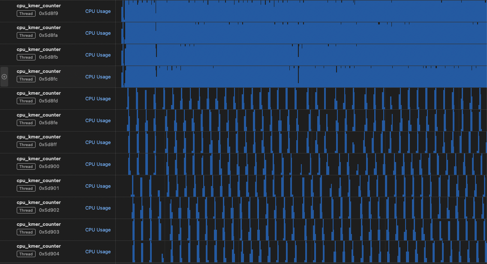
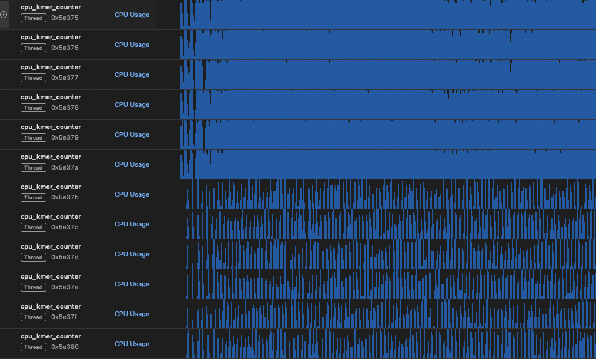
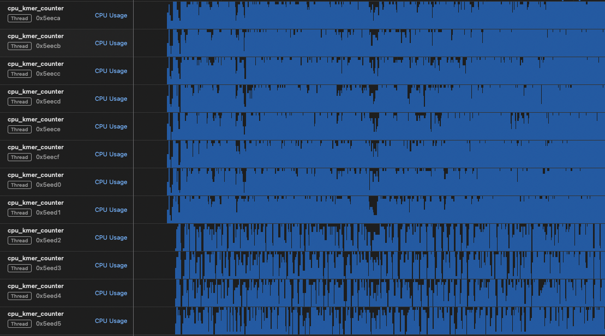

# CUDA 8-mer Frequency Analysis in the Human Genome:

## 1. Project Overview and Instructions

### Project Summary This project implements a high-performance, parallel 8-mer counter for large-scale genomic data using CUDA. It includes a multi-threaded CPU version for baseline comparison and a GPU-accelerated version for speedup. The implementation follows a producer-consumer model to efficiently handle file I/O and computation.

### How to Set Up and Run

Follow these steps to download the data, build the project, and run the analysis.

## Dependencies

### Build & Compilation 🛠️

* **CMake**: Version `4.0.3` or higher is required to configure the project.
* **C++ Compiler**: A compiler with full support for **C++20** is necessary.
* **Make**: The `build.sh` script utilizes `make` to compile the executables from the generated Makefiles.
* **pthreads**: The project relies on the POSIX threads library for multithreading, which is a standard component on most Linux/macOS systems.

### GPU-Specific Dependencies (for the GPU version) 🚀

* **NVIDIA CUDA Toolkit**: The GPU-accelerated version is built with the CUDA Toolkit. The `CMakeLists.txt` is configured for **CUDA 12.9** and requires C++20 support.
* **NVIDIA GPU**: To run the `gpu_kmer_counter`, you need an NVIDIA GPU with a compute capability of **7.5 or higher** (e.g., Turing, Ampere, Ada, Hopper architectures).

### Data Download Script 🧬

* **wget**: The `downloadHG38fasta.sh` script uses `wget` to download the human reference genome.
* **gunzip**: This is used by the same script to decompress the downloaded genome file (`.fa.gz`).

#### Step 0: Clone the repo

Clone the library `git clone https://github.com/cypher-ml/cuda8merCounter.git`

#### Step 1: Download Example Data

A script is provided to download the human reference genome (`hg38.fa`) required for the analysis.

1.  **Make the script executable:**
    ```bash
    chmod +x download_data.sh
    ```

2.  **Run the script to fetch the data:**
    ```bash
    ./download_data.sh
    ```
    This will create an `exampleData` directory and place the `hg38.fa` file inside it. **Note:** This is a large file (~3 GB uncompressed) and the download may take some time.

#### Step 2: Build the Project

The `build.sh` script automates the compilation of both the CPU and GPU executables.

1.  **Make the build script executable:**
    ```bash
    chmod +x build.sh
    ```

2.  **Run the script:**
    ```bash
    ./build.sh
    ```
    This will create the final `cpu_kmer_counter` and `gpu_kmer_counter` executables in the working directory.

#### Step 3: Run the Application

After building, you can run the desired version from the project's root directory.

```bash
# Run the multi-threaded CPU version
./cpu_kmer_counter ./exampleData/hg38.fa

# Run the GPU-accelerated version
./gpu_kmer_counter ./exampleData/hg38.fa
```

Technical Report
1. K-mer Encoding Method

To efficiently store and process the genome, each DNA base is encoded into 2 bits:

    A -> 00

    C -> 01

    G -> 10

    T -> 11

This allows four bases to be packed into a single uint8_t, reducing the total memory footprint of the genome sequence by 4x. This compact representation is also ideal for fast bitwise manipulation on the GPU, where each 8-mer can be represented as a 16-bit integer (8 k-mers * 2 bits/k-mer), which serves as a direct index into the results histogram.

2. Memory Management and Parallelization

The application uses a producer-consumer pipeline to decouple file I/O from computation, ensuring the processing units (CPU cores or the GPU) are not left idle waiting for data.

    Producer (ParallelFastaReader): Multiple CPU threads work in parallel to read large chunks from the FASTA file. Each thread is responsible for cleaning the sequence (removing headers and non-ACTG characters) and applying the 2-bit encoding.

    Concurrent Queue: Encoded data chunks are pushed into a thread-safe concurrent queue, which acts as a buffer between the producers and the consumer.

    Chunk Overlaps: To ensure no k-mers are missed at chunk boundaries, each chunk (except the first) is prepended with the last K-1 bases of the previous chunk. This redundant data is skipped during processing to prevent double-counting.

    Consumer (CPU/GPU): A single consumer thread pulls encoded chunks from the queue.

        In the CPU version, this thread further distributes the work among available CPU cores.

        In the GPU version, this thread is responsible for transferring the chunk to GPU memory (cudaMemcpyAsync) and launching the count_kmers_kernel. CUDA streams are used to overlap data transfers with kernel execution for maximum efficiency.

3. Race Condition Handling

The core challenge in parallel counting is handling simultaneous writes to the same k-mer index. This project uses atomic operations to guarantee thread safety.

    In the CUDA kernel, atomicAdd() is used on the global results histogram stored in GPU memory. This ensures that when multiple threads find the same k-mer, the master count is incremented safely without data loss or corruption.

4. CPU vs. GPU Performance Comparison

The performance benchmarks were run on the following hardware:

* **CPU**:
    * **Model**: INTEL(R) XEON(R) GOLD 6548Y+
    * **Cores**: 8
    * **Threads per Core**: 1

* **GPU**:
    * **Model**: NVIDIA RTX 4000 Ada Generation
    * **VRAM**: 20 GB
    * **CUDA Version**: 12.9
    * **Driver Version**: 575.57.08


CPU Time (7 seconds)
	
GPU Time (2 seconds)
	
Speedup Factor > 2


The results clearly demonstrate utilizing the processing power of the GPU provides a speedup over the multi-threaded CPU implementation for this task.

Speedup is not huge, this is due to the bottleneck of the task being I/O. Speedup comes from utilizing all the cpu cores for the producer task (doubles the cpu core utilization for I/O). GPU computation speed is miniscule compared to this, and it is observed that the GPU cores stay idle a lot for the hardware above.

In `stats/` folder, you can find cuda profiling stat dumps for details.

---

### 4.1. CPU Threading Analysis (Producer-Consumer Balance)

The CPU implementation uses a multi-threaded producer-consumer model to separate file I/O (producers) from k-mer counting (consumers). The key to maximizing performance in this model is to correctly balance the number of threads allocated to each task, especially since reading and decoding the FASTA file is the primary **I/O bottleneck**.

To analyze this balance, we ran the CPU-only version with different thread allocations on an Apple M4 system. The visualizations below show thread utilization for three different configurations:

1.  **4 Producers, 8 Consumers**: With fewer threads allocated to I/O, the consumer threads likely spend significant time idle, waiting for the producers to fill the data queue.

    

2.  **6 Producers, 6 Consumers**: Increasing the number of producers improves the rate at which data is fed into the pipeline. This leads to better utilization of the consumer threads compared to the previous configuration.

    

3.  **8 Producers, 4 Consumers**: This configuration allocates the majority of threads to the bottleneck task (I/O). This ensures the data queue remains full, allowing the consumer threads to work continuously without stalling. This setup yields the highest throughput by keeping all parts of the pipeline active.

    

**Conclusion**: The results demonstrate that for a pipeline with a significant I/O bottleneck, performance is gained by dedicating more hardware resources (in this case, threads) to the slowest stage. Over-allocating threads to the faster, CPU-bound consumer stage results in diminishing returns as they become starved for data.

---


5. Optimizations and Potential Improvements

    Implemented Optimization: The producer-consumer pipeline with asynchronous operations is the key optimization, effectively hiding I/O latency and keeping the GPU working.

    Potential Improvement (I/O Bottleneck): The primary remaining bottleneck is the data transfer from system RAM to GPU VRAM. For ultimate performance on compatible systems (Linux with NVMe SSDs), this could be eliminated by using NVIDIA's GPUDirect Storage. This technology allows data to be read directly from the NVMe drive into GPU memory, bypassing the CPU and system RAM entirely and maximizing I/O throughput. For cpu only task, Memory-mapped I/O can increase the speed of data retrieval.

    Potential Improvement (Kernel Optimization): The current kernel relies heavily on atomic operations, which can cause serialization. An alternative approach would be for each thread block to use its fast, on-chip shared memory to build a private histogram. These private histograms would then be merged into the global histogram in a final, much smaller step, significantly reducing contention on global memory. This optimization is not made because the effect of serialization is much less than I/O Bottleneck.